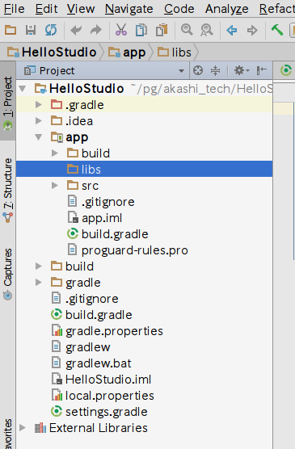
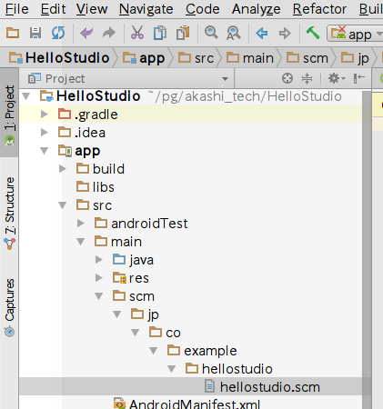
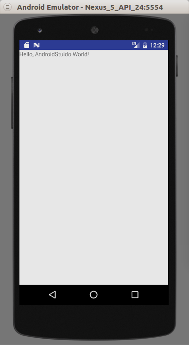

## Android上で動かす

[KawaのGradle用のPlugin](https://github.com/medranocalvo/gradle-kawa-plugin)を使って動かします。

Gradle Pluginを使うには以下の作業が必要になります。

1. Android Studioのインストールと、Android SDKのダウンロード
2. Kawaをソースコードからコンパイル
3. Android Studioプロジェクトの作成
4. build.gradleの編集
5. Schemeのコードの作成
6. 実行

## Android Studioのインストールとセットアップ

まず、Android Studioを[ダウンロード](https://developer.android.com/studio/index.html)し、インストールします。そして、Android Studioを起動し、Android SDK(ここでは、API Level 21. Android 5.0.1とします)をダウンロードします。SDK Toolは23.0.1をダウンロードしておきます。

SDKのインストール後に、ANDROID_HOMEおよびPATH環境変数を設定します。

(Android StudioとAndroid SDKは別の構成になっており、Android Studioを最初に立ち上げた時にSDKがダウンロードされます。通常はHOMEディレクトリの下にダウンロードされます)

```bash
export ANDROID_HOME=~/Android/Sdk
export PATH=$ANDROID_HOME/tools:$ANDROID_HOME/platform-tools:$PATH
```

### Kawaのコンパイル

次に、KawaをAndroid向けにコンパイルします。

[Kawaのソースコード](http://ftp.gnu.org/pub/gnu/kawa/kawa-2.2.tar.gz)をダウンロードします。ダウンロード後、適当なディレクトリで展開し、展開したディレクトリに移動します。

```bash
$ tar -zxvf kawa-2.2.tar.gz
$ cd kawa-2.2/
```

実機のAPIレベルを環境変数に設定をします。

```bash
$ export ANDROID_PLATFORM=android-21
```

ダウンロードしたSDKのAPIレベルが分からない場合は以下のコマンドで確認できます。

```bash
$ android list targets
Available Android targets:
----------
id: 1 or "android-21"
     Name: Android 5.0.1
     Type: Platform
     API level: 21
     Revision: 2
     Skins: HVGA, QVGA, WQVGA400, WQVGA432, WSVGA, WVGA800 (default), WVGA854, WXGA720, WXGA800, WXGA800-7in
 Tag/ABIs : no ABIs.
```

JAVA_HOME(Java Development Kitのインストール・ディレクトリ: Java Runtime Environmentの方ではありません)の環境変数を設定します。

```bash
$ export JAVA_HOME=/usr/lib/jvm/java-8-oracle
```

Antを使用して、kawaをビルドします。

```bash
kawa-2.2$ ant -Denable-android=true
```

lib/kawa.jar にAndroid用のjarファイルが作成されます。

### Android Studioプロジェクトの作成

1. Android Studioを起動します。
2. メニューから、[File] - [New] - [New Project...] を選択して、プロジェクトの作成のウィザードを起動します。
3. [Application Name]に「HelloStudio」、[Company Domain]に「example.co.jp」を入力し、[Next]をクリックします。
4. [Phone and Tablet]にチェックが入っている事を確認し、[Minimum SDK]を選択し、[Next]をクリックします。
5. [Add No Activity]を選択し、[Finish]をクリックします。
6. 左上のナビゲーション・バーで、[HelloStudio] - [app] - [libs] と選択して、アプリのjarライブラリディレクトリを開きます。

7. 「Kawaのコンパイル」でコンパイルした、[Kawa.jar]ファイルをlibsディレクトリにコピーします。
8. [app]の方の[build.gradle]ファイル(AndroidStudioのプロジェクトの直下のファイルではありません)を以下のように編集し、Kawaのプラグインの設定を追加します。
```gradle
buildscript {
    project.ext {
        if (!project.hasProperty('kawaJarPath')) {
            project.ext.kawaJarPath = './libs/kawa.jar'
        }
    }
}

plugins {
    /*
     * This plugin is used to override project properties via the command line.
     * This allows us to change various properties when testing, most
     * importantly plugin versions and the build directory location
     * (project.buildDir).
     */
    id 'nebula.override' version '3.0.2'
    /*
     * Need to use the new plugins script block to get automatic injection of
     * code under test.  See:
     * https://docs.gradle.org/current/userguide/test_kit.html#sub:test-kit-classpath-injection
     */
    id "com.medranocalvo.gradle.gradle-android-kawa-plugin" version "0.9"
}

apply plugin: 'com.android.application'
apply plugin: "com.medranocalvo.gradle.gradle-android-kawa-plugin"

android {
    compileSdkVersion 24
    buildToolsVersion "24.0.3"
    defaultConfig {
        applicationId "jp.co.example.hellostudio"
        minSdkVersion 21
        targetSdkVersion 24
        versionCode 1
        versionName "1.0"
        testInstrumentationRunner "android.support.test.runner.AndroidJUnitRunner"
    }
    buildTypes {
        release {
            minifyEnabled false
            proguardFiles getDefaultProguardFile('proguard-android.txt'), 'proguard-rules.pro'
        }
    }
}

dependencies {
    compile files(kawaJarPath)
    compile fileTree(dir: 'libs', include: ['*.jar'])
    androidTestCompile('com.android.support.test.espresso:espresso-core:2.2.2', {
        exclude group: 'com.android.support', module: 'support-annotations'
    })
    compile 'com.android.support:appcompat-v7:24.2.1'
    testCompile 'junit:junit:4.12'
}
kawa {
    language 'scheme'
}

android {
    sourceSets {
        main {
            kawa {
                /*
                 * Paths where Scheme sources are looked up can be specifyed
                 * for each source set.  The default path for the 'main' source
                 * set is "src/main/scm".
                 */
                srcDir "src/some/other/path"
            }
        }
    }

    /*
     * Kawa configuration for android.  Enable inlining (it is enabled by
     * default anyway).
     */
    kawa {
        inline true
    }

    buildTypes {
        debug {
            /*
             * BuildType-specific Kawa configuration.  Disable inlining for
             * debug builds, overriding the android configuration.
             */
            kawa {
                inline false
            }
        }
    }
}
```

9. "app/src/main"ディレクトリの配下に"scm/jp/co/example/hellostudio/hellostudio.scm"ファイルを作成します。

10. hellostudio.scmファイルを以下のように編集します。  
```scheme
(define-library (jp co example hellostudio hellostuido)
  (import
    ;; Android
    (class android.app Activity)
    (class android.os Bundle)
    ;; Scheme
    (scheme base)
    (kawa base))
  (export HelloStudioActivity)
  (begin
    (define-simple-class HelloStudioActivity (Activity)
      ((onCreate (saved-state::android.os.Bundle))::void
       (let ((act (this)))
	 (invoke-special android.app.Activity act 'onCreate saved-state)
	 (kawa.standard.Scheme:registerEnvironment)
	 (let ((t (android.widget.TextView act)))
	   (t:setText "Hello, AndroidStuido World!")
	   (act:setContentView t)))))))</pre>
```
11. AndroidManifest.xmlファイルを以下のように編集します。
```xml
<manifest xmlns:android="http://schemas.android.com/apk/res/android"
    package="jp.co.example.hellostudio">

    <application
        android:allowBackup="true"
        android:icon="@mipmap/ic_launcher"
        android:label="@string/app_name"
        android:supportsRtl="true"
        android:theme="@style/AppTheme">
        <activity android:name=".HelloStudioActivity">
            <intent-filter>
                <action android:name="android.intent.action.MAIN" />

                <category android:name="android.intent.category.LAUNCHER" />
            </intent-filter>
        </activity>

    </application>

</manifest>
```

12. アプリを実行するとSchemeのActivityが表示されます。  

