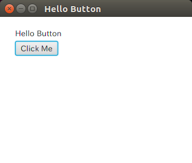
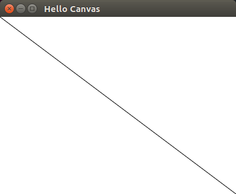
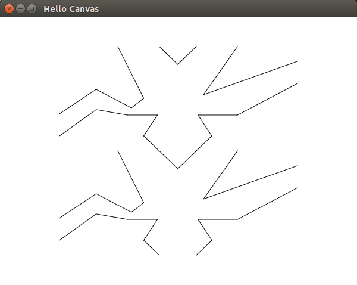

## GUI(JavaFX)

Schemeを本格的に仕事に使おう思っても、躊躇する理由の一つにGUIをサポートしている処理系が少ないと点があります。

Kawaは、Java上で動作しているので、Javaの最近のGUIライブラリであるJavaFXを使用して手軽にGUIアプリケーションを作成できます。

まず、以下のようなHelloButton.scmのファイルを作成します。
```scheme
(require 'javafx-defs)

(define-alias Label javafx.scene.control.Label)
(javafx-application)

(javafx-scene
 title: "Hello Button"
 width: 600 height: 450
 (Label
  text: "Hello Button"
  layout-x: 25
  layout-y: 20)
 (Button
  text: "Click Me"
  layout-x: 25
  layout-y: 40
  on-action: (lambda (e) (format #t "Event: ~s~%~!" e))))
```

ファイルを作成後、以下のようにKawaを起動すると新しいウィンドウが表示されます。(kawa.jarはご自身の環境に合わせてください)

```bash
$ java -cp /usr/local/lib/kawa.jar kawa.repl HelloButton.scm &
```




JavaのCanvasクラスを以下のように使用すると、線を引くこともできます。
```scheme
(require 'javafx-defs)

(define-alias Canvas javafx.scene.canvas.Canvas)

(javafx-application)

(javafx-scene
 title: "Hello Canvas"
 width: 600 height: 450
 (let* ((canvas (Canvas
		 width: 600
		 height: 450))
	(gc (canvas:getGraphicsContext2D)))
   (gc:strokeLine 0 0 600 450)
   canvas))
```




SICPの図形言語のwaveも以下のように書ける。

```scheme
(require 'javafx-defs)

(define-alias Canvas javafx.scene.canvas.Canvas)

(javafx-application)

(define *graphics-context* #f)

;; フレーム
(define (frame-coord-map frame)
  (lambda (v)
    (add-vect
     (origin-frame frame)
     (add-vect (scale-vect (xcor-vect v)
			   (edge1-frame frame))
	       (scale-vect (ycor-vect v)
			   (edge2-frame frame))))))

(define (make-vect x y)
  (cons x y))

(define (xcor-vect v)
  (car v))

(define (ycor-vect v)
  (cdr v))

(define (add-vect v1 v2)
  (make-vect (+ (xcor-vect v1) (xcor-vect v2))
	     (+ (ycor-vect v1) (ycor-vect v2))))

(define (sub-vect v1 v2)
  (make-vect (- (xcor-vect v1) (xcor-vect v2))
	     (- (ycor-vect v1) (ycor-vect v2))))

(define (scale-vect s v)
  (make-vect (* s (xcor-vect v))
	     (* s (ycor-vect v))))

(define (make-frame origin edge1 edge2)
  (cons origin (cons edge1 edge2)))

(define (origin-frame frame)
  (car frame))

(define (edge1-frame frame)
  (let ((edge (cdr frame)))
    (car edge)))

(define (edge2-frame frame)
  (let ((edge (cdr frame)))
    (cdr edge)))

;; ペインタ
(define (segments-&gt;painter segment-list)
  (lambda (frame)
    (for-each
     (lambda (segment)
       (draw-line
	((frame-coord-map frame) (start-segment segment))
	((frame-coord-map frame) (end-segment segment))))
     segment-list)))

(define (draw-line start-vec end-vec)
  (*graphics-context*:strokeLine
   (xcor-vect start-vec) (ycor-vect start-vec)
   (xcor-vect end-vec) (ycor-vect end-vec)))

(define (make-segment start-vect end-vect)
  (cons start-vect end-vect))

(define (start-segment segment)
  (car segment))

(define (end-segment segment)
  (cdr segment))

(define wave-painter
  (segments-&gt;painter
    (list (make-segment (make-vect 0.000 0.645) (make-vect 0.154 0.411))
          (make-segment (make-vect 0.154 0.411) (make-vect 0.302 0.588))
          (make-segment (make-vect 0.302 0.588) (make-vect 0.354 0.497))
          (make-segment (make-vect 0.354 0.497) (make-vect 0.245 0.000))
          (make-segment (make-vect 0.419 0.000) (make-vect 0.497 0.171))
          (make-segment (make-vect 0.497 0.171) (make-vect 0.575 0.000))
          (make-segment (make-vect 0.748 0.000) (make-vect 0.605 0.462))
          (make-segment (make-vect 0.605 0.462) (make-vect 1.000 0.142))
          (make-segment (make-vect 1.000 0.354) (make-vect 0.748 0.657))
          (make-segment (make-vect 0.748 0.657) (make-vect 0.582 0.657))
          (make-segment (make-vect 0.582 0.657) (make-vect 0.640 0.857))
          (make-segment (make-vect 0.640 0.857) (make-vect 0.575 1.000))
          (make-segment (make-vect 0.419 1.000) (make-vect 0.354 0.857))
          (make-segment (make-vect 0.354 0.857) (make-vect 0.411 0.657))
          (make-segment (make-vect 0.411 0.657) (make-vect 0.285 0.657))
          (make-segment (make-vect 0.285 0.657) (make-vect 0.154 0.605))
          (make-segment (make-vect 0.154 0.605) (make-vect 0.000 0.857)))))

;; ペインタの変換と組み合わせ
(define (transform-painter painter origin corner1 corner2)
  (lambda (frame)
    (let ((m (frame-coord-map frame)))
      (let ((new-origin (m origin)))
	(painter
	 (make-frame new-origin
		     (sub-vect (m corner1) new-origin)
		     (sub-vect (m corner2) new-origin)))))))

(define (rotate90 painter)
  (transform-painter painter
		     (make-vect 1.0 0.0)
		     (make-vect 1.0 1.0)
		     (make-vect 0.0 0.0)))

(define (beside painter1 painter2)
  (let ((split-point (make-vect 0.5 0.0)))
    (let ((paint-left
	   (transform-painter painter1
			      (make-vect 0.0 0.0)
			      split-point
			      (make-vect 0.0 1.0)))
	  (paint-right
	   (transform-painter painter2
			      split-point
			      (make-vect 1.0 0.0)
			      (make-vect 0.5 1.0))))
      (lambda (frame)
	(paint-left frame)
	(paint-right frame)))))
			      
(define (rotate180 painter)
  (transform-painter painter
		     (make-vect 1.0 1.0)
		     (make-vect 0.0 1.0)
		     (make-vect 1.0 0.0)))
(define (rotate270 painter)
  (rotate90 (rotate180 painter)))


(define (below painter1 painter2)
  (let ((split-point (make-vect 0.0 0.5)))
    (let ((paint-top
	   (transform-painter painter2
			      split-point
			      (make-vect 1.0 0.5)
			      (make-vect 0.0 1.0)))
	  (paint-bottom
	   (transform-painter painter1
			      (make-vect 0.0 0.0)
			      (make-vect 1.0 0.0)
			      split-point)))
      (lambda (frame)
	(paint-top frame)
	(paint-bottom frame)))))

(define (below2 painter1 painter2)
  (rotate270 (beside (rotate90 painter1) (rotate90 painter2))))

(javafx-scene
 title: "Hello Canvas"
 width: 600 height: 450
 (let ((canvas (Canvas width: 600 height: 450))
       (frame (make-frame (make-vect 100 50)
				(make-vect 400 0) (make-vect 0 350))))
   (set! *graphics-context* (canvas:getGraphicsContext2D))
   ((below2 wave-painter wave-painter) frame)
   canvas))
```


