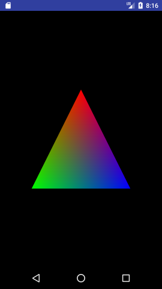

## OpenGL(Android編)

Android上でOpenGLを使って描画するには、GLSurfaceViewにRendererをセットして描画します。

[Android上で動かす](http://akashi-tech.com/programing/kawa-scheme/android-gradle-plugin/)と同様にプロジェクトを作成して、以下のようにActivityの派生クラスとRendererの実装クラスを作成します。
```scheme
(define-library (jp co example helloopengl helloopengl)
  (import
   ;; Android
   (class android.app Activity)
   (class android.content Context)
   (class android.graphics Color)
   (class android.opengl GLES20 GLSurfaceView GLUtils Matrix)
   (class android.os Bundle)
   (class android.util Log)
   (class java.io BufferedReader InputStream InputStreamReader)
   (class java.lang Math StringBuilder System)
   (class java.nio ByteBuffer ByteOrder FloatBuffer)
   (class javax.microedition.khronos.egl EGLConfig)
   (class javax.microedition.khronos.opengles GL10)
   (class jp.co.example.helloopengl R)
   ;; Scheme
   (scheme base)
   (kawa base))
  (require 'srfi-1)
  (export HelloOpenGLActivity)
  (begin
    ;;;;;; リソース・ユーティリティ
    ;;;; テキスト・ファイル・リーダー
    (define-simple-class TextResourceReader ()
      ((readTextFileFromResource (context ::Context) (resourceId ::int)) allocation: 'static
       (let* ((body ::StringBuilder (StringBuilder))
	      (inputStream ::InputStream ((context:getResources):openRawResource resourceId))
	      (inputStreamReader ::InputStreamReader (InputStreamReader inputStream))
	      (bufferdReader ::BufferedReader (BufferedReader inputStreamReader)))
	 (let loop ((nextLine ::String (bufferdReader:readLine)))
	   (cond
	    ((not (equal? nextLine #!null))
	     (body:append nextLine)
	     (body:append "\n")
	     (loop (bufferdReader:readLine)))
	    (else (body:toString)))))))

    ;;;;;; シェーダー
    ;;;; シェーダー・ヘルパークラス
    (define-simple-class ShaderHelper ()
      ;;;; シェーダーコードをコンパイルします。
      ((compileShader type shaderCode) allocation: 'static
       (let ((shaderObjecctId (GLES20:glCreateShader type)))
	 (GLES20:glShaderSource shaderObjecctId shaderCode)
	 (GLES20:glCompileShader shaderObjecctId)
	 (let ((compileStatus (int[] length: 1)))
	   (GLES20:glGetShaderiv shaderObjecctId GLES20:GL_COMPILE_STATUS compileStatus 0)
	   (if (= (compileStatus 0) 0)
	       (begin
		 (Log:d "ShaderHelper:compileShader"
			(string-append
			 "Compile Error: "
			 shaderCode " "
			 (GLES20:glGetShaderInfoLog shaderObjecctId)))
		 )))
	 shaderObjecctId))
      
      ;;;; 頂点シェーダーコードをコンパイルします。
      ((compileVertexShader shaderCode) allocation: 'static
       (compileShader GLES20:GL_VERTEX_SHADER shaderCode))
      
      ;;;; フラグメント・シェーダーコードをコンパイルします。
      ((compileFragmentShader shaderCode) allocation: 'static
       (compileShader GLES20:GL_FRAGMENT_SHADER shaderCode))
      
      ;;;; シェーダーをリンクします。
      ((linkProgram vertexShaderId fragmentShaderId) allocation: 'static
       (let ((programObjectId (GLES20:glCreateProgram)))
	 (GLES20:glAttachShader programObjectId vertexShaderId)
	 (GLES20:glAttachShader programObjectId fragmentShaderId)
	 (GLES20:glLinkProgram programObjectId)
	 programObjectId))
      
      ;;;; プログラムをビルドします。
      ((buildProgram vertexShaderSource fragmentShaderSource) allocation: 'static
       (let ((vertexShader (compileVertexShader vertexShaderSource))
	     (fragmentShader (compileFragmentShader fragmentShaderSource)))
	 (linkProgram vertexShader fragmentShader)))
      
      ;;;; プログラムを検証します。
      ((validateProgram programObjectId) allocation: 'static
       (GLES20:glValidateProgram programObjectId)
       (let ((validateStatus (int[] length: 1)))
	 (GLES20:glGetProgramiv programObjectId GLES20:GL_VALIDATE_STATUS validateStatus 0)
	 (if (= (validateStatus 0) 0)
	     (Log:d "validateProgram" "Program Error")))))

    ;;;; シェーダー・クラス
    (define-simple-class ShaderProgram ()
      (U_MATRIX ::string init: "u_Matrix" allocation: 'static)
      (U_COLOR ::string init: "u_Color" allocation: 'static)
      
      (A_POSITION ::string init: "a_Position" allocation: 'static)
      (A_COLOR ::string init: "a_Color" allocation: 'static)

      (program ::int)
      
      ;;;; コンストラクタ
      ((*init*) #!void)
      ((*init* (context ::Context) (vertexShaderSourceId ::int) (fragmentShaderSourceId ::int))
       (set! program (ShaderHelper:buildProgram
		      (TextResourceReader:readTextFileFromResource context vertexShaderSourceId)
		      (TextResourceReader:readTextFileFromResource context fragmentShaderSourceId)))
       (ShaderHelper:validateProgram program))

      ;;;;
      ((useProgram)
       (GLES20:glUseProgram program)))

    (define-simple-class SimpleShaderProgram (ShaderProgram)
      (uMatrixLocation ::int)
      
      (aPositionLocation ::int)
      (aColorLocation ::int)

      ;;;; コンストラクタ
      ((*init*) #!void)
      ((*init* (context ::Context))
       (invoke-special ShaderProgram (this) '*init*
		       context R:raw:simple_vertex_shader R:raw:simple_fragment_shader)
       ;; シェーダー・プログラムのuniform locatinを検索
       (set! uMatrixLocation (GLES20:glGetUniformLocation program ShaderProgram:U_MATRIX))

       ;; シェーダー・プログラムのattribute locationを検索
       (set! aPositionLocation (GLES20:glGetAttribLocation program ShaderProgram:A_POSITION))
       (set! aColorLocation (GLES20:glGetAttribLocation program ShaderProgram:A_COLOR)))

      ((setUniforms (matrix ::float[])) ::void
       (GLES20:glUniformMatrix4fv uMatrixLocation 1 #f matrix 0))

      ((getPositionAttributeLocation) ::int
       aPositionLocation)

      ((getColorAttributeLocation) ::int
       aColorLocation))

    ;;;; 頂点配列クラス
    (define-simple-class VertexArray ()
      (BYTES_PER_FLOAT ::int allocation: 'static init: 4)
      (floatBuffer ::FloatBuffer)

      ;;;; コンストラクタ
      ((*init*) #!void)
      ((*init* (vertexData ::float[]))
       (set! floatBuffer
	     (*:put (*:asFloatBuffer (*:order (ByteBuffer:allocateDirect (* vertexData:length BYTES_PER_FLOAT))
					      (ByteOrder:nativeOrder)))
		    vertexData)))

      ;;;;
      ((setVertexAttribPointer (dataOffset ::int) (attributeLocation ::int)
			       (componentCount ::int) (stride ::int)) ::void
       (floatBuffer:position dataOffset)
       (GLES20:glVertexAttribPointer attributeLocation componentCount GLES20:GL_FLOAT #f stride floatBuffer)
       (GLES20:glEnableVertexAttribArray attributeLocation)
       (floatBuffer:position 0))

      ;;;;
      ((updateBuffer (vertexData ::float[]) (start ::int) (count ::int)) ::void
       (floatBuffer:position start)
       (floatBuffer:put vertexData start count)
       (floatBuffer:position 0)))

    (define-simple-class Triangle ()
      (COORDS_PER_VERTEX ::int allocation: 'static init: 3)

      (VERTEX_DATA ::float[] allocation: 'static
		   init: (float[]
			        0.0  0.8  0.0
			       -0.8 -0.8  0.0
			        0.8 -0.8  0.0))

      (COLOR_DATA ::float[] allocation: 'static
		  init: (float[]
			      1.0 0.0 0.0 1.0
			      0.0 1.0 0.0 1.0
			      0.0 0.0 1.0 1.0))

      (verices ::VertexArray)
      (colors ::VertexArray)
      
      ((*init*)
       (set! verices (VertexArray VERTEX_DATA))
       (set! colors (VertexArray COLOR_DATA)))

      ((bindData (shaderProgram ::SimpleShaderProgram)) ::void
       (verices:setVertexAttribPointer
	0 (shaderProgram:getPositionAttributeLocation) COORDS_PER_VERTEX 0)
       (colors:setVertexAttribPointer
	0 (shaderProgram:getColorAttributeLocation) 4 0))

      ((draw) ::void
       (GLES20:glDrawArrays GLES20:GL_TRIANGLES 0 3)))
    
    ;;;; Rendererクラス
    (define-simple-class TriangleRenderer (GLSurfaceView:Renderer)
      ;;;; メンバー変数の宣言
      (context ::Context)

      (modelMatrix ::float[] init: (float[] length: 16))
      (viewMatrix ::float[] init: (float[] length: 16))
      (projectionMatrix ::float[] init: (float[] length: 16))
      (viewProjectionMatrix ::float[] init: (float[] length: 16))
      (modelViewProjectionMatrix ::float[] init: (float[] length: 16))

      (program ::SimpleShaderProgram)
      (triangle ::Triangle)

      ;;;; デフォルト・コンストラクタ
      ((*init*) #!void)
      ;;;; コンストラクタ
      ((*init* (context ::Context))
       (kawa.standard.Scheme:registerEnvironment)
       (set! (this):context context))
      
      ;;;;
      ((onSurfaceCreated (gl ::GL10) (config ::EGLConfig)) ::void
       (GLES20:glClearColor 0.0 0.0 0.0 0.0)
       (set! program (SimpleShaderProgram context))
       (set! triangle (Triangle)))
      
      ;;;;
      ((onSurfaceChanged (gl ::GL10) (width ::int) (height ::int)) ::void
       (GLES20:glViewport 0 0 width height)
       (Matrix:perspectiveM projectionMatrix 0 45 (as &lt;float&gt; (/ width height)) 1.0 10.0)
       (Matrix:setIdentityM viewMatrix 0)
       (Matrix:translateM viewMatrix 0 0.0 0.0 -5.0)
       (Matrix:multiplyMM viewProjectionMatrix 0 projectionMatrix 0 viewMatrix 0))
      
      ;;;;
      ((onDrawFrame (gl ::GL10)) ::void
       (GLES20:glClear GLES20:GL_COLOR_BUFFER_BIT)
       (program:useProgram)
       (program:setUniforms viewProjectionMatrix)
       (triangle:bindData program)
       (triangle:draw)))
    
    ;;;; Activityクラス
    (define-simple-class HelloOpenGLActivity (Activity)
      ;;
      (glSurfaceView ::GLSurfaceView)
      (renderSet ::boolean)
      ;;
      ((onCreate (saved-state::Bundle)) ::void
       (invoke-special Activity (this) 'onCreate saved-state)
       (set! glSurfaceView (GLSurfaceView (this)))
       (glSurfaceView:setEGLContextClientVersion 2)
       (glSurfaceView:setRenderer (TriangleRenderer (this)))
       ((this):setContentView glSurfaceView))
       
      ;;
      ((onPause) ::void
       (invoke-special Activity (this) 'onPause)
       (if renderSet (glSurfaceView:onPause)))
      ;; 
      ((onResume) ::void
       (invoke-special Activity (this) 'onResume)
       (if renderSet (glSurfaceView:onResume))))))
```

以下のように、res/rawのディレクトリにシェーダープログラムを作成します。

simple_vertex_shader.glsl

```c
uniform mat4 u_Matrix;
attribute vec3 a_Position;
attribute vec3 a_Color;
varying vec3 v_Color;

void main()
{
  v_Color = a_Color;
  gl_Position = u_Matrix * vec4(a_Position, 1.0);
}
```

simple_fragment_shader.glsl

```c
precision mediump float;
varying vec3 v_Color;

void main()
{
  gl_FragColor = vec4(v_Color, 1.0);
}
```

三角形が以下のように表示されます。


